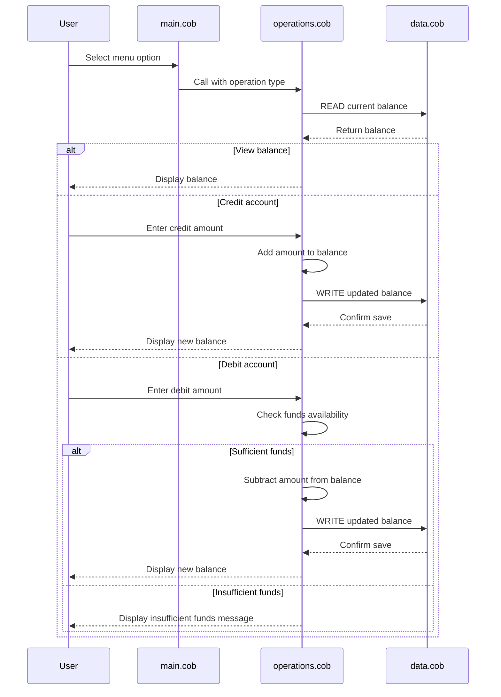

# COBOL Account Management Documentation

## Overview

This project contains a small COBOL-based account management sample that demonstrates a simple menu-driven workflow for viewing and updating an account balance. The programs are organized around a main entry point, an operations module, and a data module that stores the current balance.

## File Purpose Summary

### main.cob
Purpose:
- Serves as the user-facing entry program for the application.
- Presents a menu with options to view balance, credit the account, debit the account, or exit.

Key functions:
- Displays the account management menu.
- Reads the user’s menu choice from input.
- Calls the operations program for each supported action.
- Repeats until the user chooses to exit.

### operations.cob
Purpose:
- Contains the business logic for balance-related actions.
- Acts as the middle layer between the user interface and the persistent data program.

Key functions:
- Handles the `TOTAL`, `CREDIT`, and `DEBIT` operations.
- Reads the current balance from the data program.
- Updates the balance for credit and debit actions.
- Prevents debits that would take the balance below zero.

### data.cob
Purpose:
- Stores and retrieves the account balance.
- Functions as the simple persistence layer for the sample application.

Key functions:
- Supports a `READ` operation that returns the stored balance.
- Supports a `WRITE` operation that saves an updated balance.
- Maintains a default balance of `1000.00` when the program starts.

## Inferred Business Rules

The current COBOL implementation encodes the following account rules:

- The account starts with an initial balance of `1000.00`.
- A user can view the current balance at any time.
- A credit transaction increases the balance by the entered amount.
- A debit transaction decreases the balance by the entered amount.
- Debit transactions are only allowed when the account has enough funds.
- If a debit exceeds the current balance, the program displays an "Insufficient funds" message and does not update the balance.

## Student Account Notes

This sample does not currently contain student-specific fields or rules such as tuition, scholarships, or fee schedules. The logic is a generic account-management example that can be adapted for a student account scenario.

If this program were extended for student accounts, the following business rules would be natural additions:

- Restrict or monitor overdraws more strictly for student accounts.
- Support account fees or tuition-related deductions.
- Track account activity for a specific student ID.
- Enforce different limits for credits and debits based on student status.

## Application Data Flow

